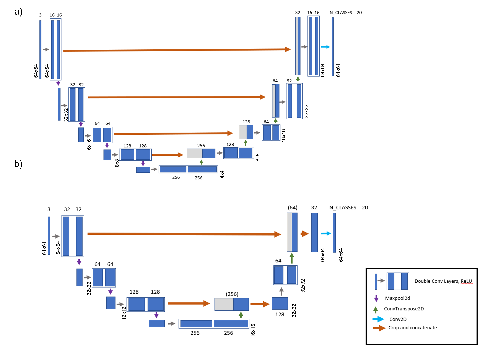
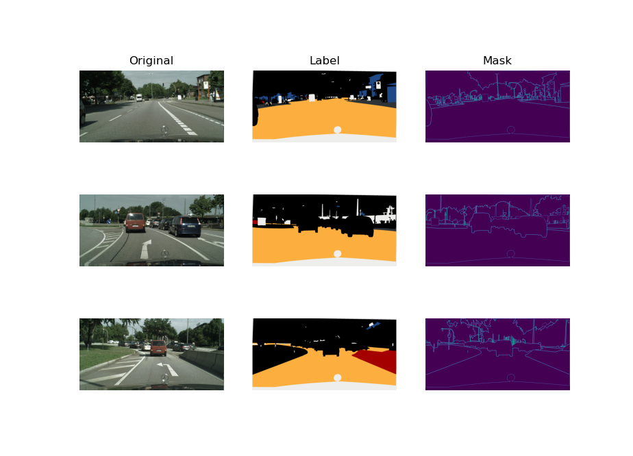
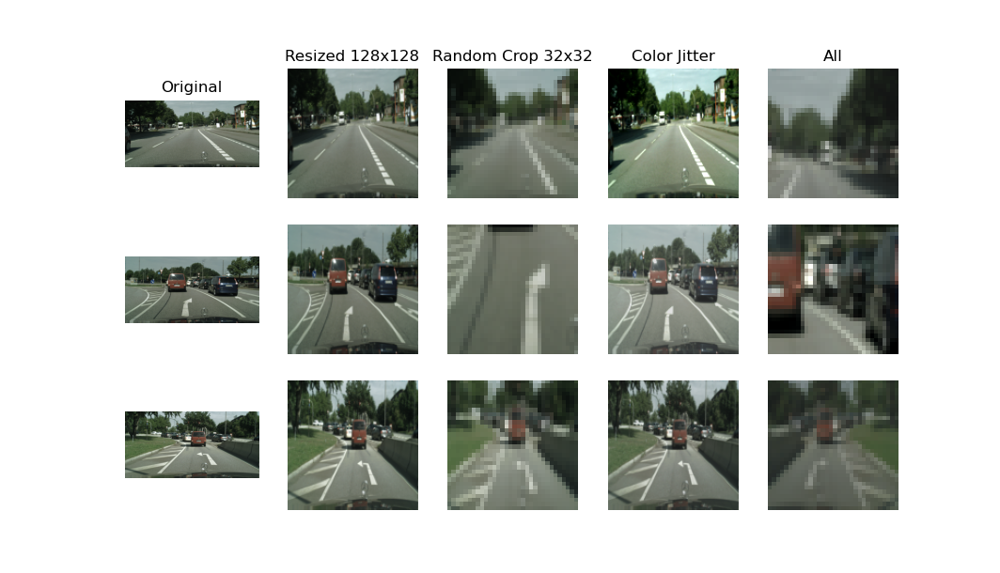
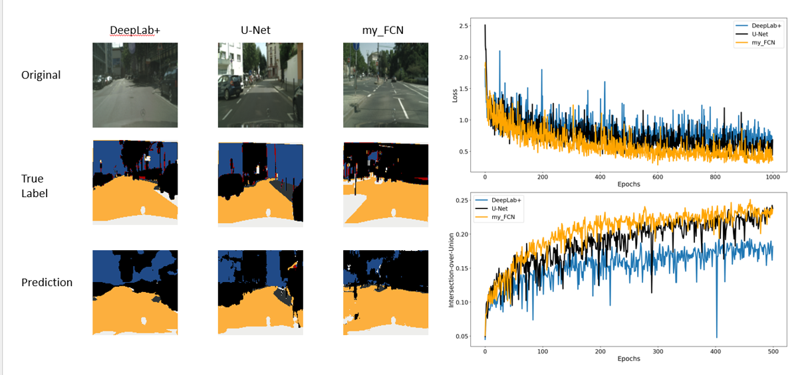

# Image Segmentation on Cityscapes Dataset

## Objective

The motivation for this project is to explore various different models for semantic segmentation using modest computational resources (i.e., a gaming laptop). For this effort, I have explored a built-from-scratch Unet that I constructed and compared these results to various other model architectures, including a popular reference UNet model, and DeepLabV3+ (with ResNet-101 encoder network). 

Another crucial piece of this study was to find a well-annotated multi-class dataset suitable for semantic segmentation. The Cityscapes dataset was chosen because it is well-understood, well-annotated, and easy to download free of charge (details are given below). 

___________________________________

## Cityscapes Dataset


Download the dataset here: 

**Cityscapes: Semantic Understanding of Urban Street Scenes.** https://www.cityscapes-dataset.com/downloads
(Note: You need to register to download the files, but it's relatively painless.)

Given that these are large files of several or more Gigabytes, it is important for the practitioner to judiciously select only the data needed for the specific task of interest. The focus of this study is to test the performance of different models for semantic segmentation, so the following datasets (file size in paratheses) were downloaded: **gtFine_trainvaltest.zip** (241MB) and **leftmg8bit_trainvaltest.zip** (11GB). 

The gtFine_trainvaltest.zip dataset contains multiple annotations. Of these files, *gtFine_labellds were the files used for labels and also for creating the segmentation masks. 

The leftmg8bit_trainvaltest.zip dataset contains the original 2048x1024 images of the different street scenes with extension names *leftlmg8bit.png. 

(For this task, object detection and classification by color were not explored so the *gtFine_polygons.json and *gtFine_color.png files were never used, nor were the *gtFine_instancelds.png files since we focus only on semantic segmentation in this current code.)

After unzipping these files, you will find the subdirectories: **train**, **val**, and **test**. We focus on the files contained in train and val folders.

From these datasets, a smaller subset was created from the Hamburg data (in train/Hamburg/) and Frankfurt data (in val/Frankfurt/). The reason for using a smaller subset was to speed the runtime for training the models so as to achieve some preliminary results. (Of course, training on the full dataset will improve the model performance.)

 Your directory structure should look like this (for logging later on, optionally add a folder called myfcn_test or whichever name you prefer.)

```
SemanticSegmentationCityscapes/

   myfcn_test/
   small_dataset/
      train/
         (files from train/Hamburg folder with the following extensions:)
         *gtFine_labellds.png
         *leftlmg8bit.png
      valid/
         (files from val/Frankfurt folder with the following extensions:)
         *gtFine_labellds.png
         *leftlmg8bit.png
   seg_code/
      __init__.py
      models.py
      train.py
      utils.py
      special_transforms.py
   ```
   
   Check out **Create_Data.ipynb** to automate the creation of the folder and files for small_dataset/
   
   (You can also create the test dataset, as outlined in Create_Data.ipynb and test your results using test.py.)
   
 ---------------------------------------------------------------------------------------
## Computational Details

This work is focused on exploring different image segmentation models using a well-understood and well-annotated dataset. Moroever, this work is designed for running on modest resources (in my case, a gaming laptop with 1 GPU). The computational details are summarized in Table 1 below:


| Table 1          | Computational Details                                                 |
| ---------        |  --------------------                                                 |
| Hardware	       |  1 GPU NVIDIA GeForce GTX 1660 Ti                                     |
| Framework	    | PyTorch 1.8.1 (Paszke & et al, 2019)                                     |
| Number of Epochs |	500                                                                   |
| Batch Size	   |   8                                                                      |
| Learning rate	|  1x10-3                                                                  |
| Optimizer	    | Adam optimizer with weight decay of 1 x10-5 (Kingma & Ba, 2014)          |
| Criterion	    | Cross Entropy Loss with Focal Loss (Lin et al., 2018)                    |
| Dataset	      | Cityscapes dataset (using only the Hamburg and Frankfurt subsets)        |
| Evaluation Metrics |	Global accuracy, average accuracy and Intersection-over-Union (IoU) |


We want to 
1. Visualize the Cityscapes dataset
2. Practice data pre-processing techniques (data augmentation)
3. Train a simple image segmentation network (my_FCN, Figure 1b) to accurately classify objects appearing in the street scenes (cars, footpath, road, pedestrians, etc.). 
4. Compare this network to UNet (Figure 1a) and DeepLabV3+


Figure 1. Structures of different U-Net architectures. a) The U-Net architecture. b) my_FCN architecture designed in this work. Each architecture consists of a contracting path (left side), a bottleneck (bottom), and an expansive path (right side). Each blue block represents a multi-channel feature map with the number of channels denoted on top of the box. The height (H) and width (W) size is provided at the lower edge of the box. Grey boxes in the expansion path represent cropped and concatenated feature maps. The horizontal and vertical arrows denote downsampling (“MaxPool2d”), upsampling (“ConvTranspose2D”), 3x3 convolutional (“Double Conv Layers”), 1x1 convolutional (“Conv2D”), and concatenating (“Crop and concatenate”) operations. 
_________________________________________________________________________________________
## Setting up your environment with Conda

Install dependencies using:

<code> python -m pip install -r requirements.txt </code>

and if you are using conda use:

<code> conda env create torch_segment.yml </code>

which can be activated for your Python environment using: 

<code> conda activate torch_segment </code>

--------------------------------------------------------------------------------------------------------

## Training the Models

You can train the models using the shallow network, my_FCN, using the following command:

<code> python -m seg_code.train -m my_fcn </code>

To train the reference UNet, the code is: 

<code> python -m seg_code.train -m unet </code>

To train the DeepLab (with pretrained ResNet-101), the code is: 

<code> python -m seg_code.train -m deeplab </code>

--------------------------------------------------------------------------------------------------------

## Testing the Models

You can test the models on the test set using the following command:

<code> python -m seg_code.test -m my_fcn </code>

Instead of 'my_fcn', you can also check out 'unet' or 'deeplab'.

---------------------------------------------------------------------

## Visualizing the Cityscapes Dataset

To do some visualization:

Here is the code you can run before training the model to see a snapshot of what the dataset looks like:

<code> python -m seg_code.utils  </code>

Running this code will create three figures:


Figure 2. Example files of the Cityscapes dataset. The original images are 2048x1024 size and are labeled as *leftlmg8bit.png; while the labels are given *gtFine_labellds.png. 


Figure 3. Pixel Distribution of the Different Classes in the Training Dataset (Based on 20 Classes). The category “Unlabelled” is the sum of 14 classes that were pooled into the unlabelled category, hence why it has a relatively large percentage of pixel counts. The classes labeled ‘road’, ‘building’, ‘vegetation’, and ‘car’ also have a large share of the total number of pixels in the training dataset. The labels ‘sidewalk’ and ‘sky’ each make up roughly 5% of the dataset.


Figure 4. Data augmentation, including resizing, random cropping, and color jitter, each individually applied to the data and altogether in “All”.
_____________________________________________________________________
## Logging on TensorBoard

If you want to use Tensorboard, here is some extra code:

<code> python -m seg_code.train -m my_fcn --log_dir myfcn_test -n 500 </code>

followed by:

<code> tensorboard --logdir=myfcn_test --port 6006 --bind_all  </code>
             
the message you'll receive will give you something like:

<code> http://your-Laptop-name:6006/ </code>

click on the address you get and open it in a web browser. See the interactive tensorboard. Done! :)

The results that I've collected according to the details in Table 1 are shown in Figure 5. (These data and images were taken from TensorBoard results.)


Figure 5. Model performance. Comparison of segmentation maps predicted for each of the models (DeepLabV3+, U-Net, and my_FCN) after 500 epochs are shown in the left-side panel. The right-side panel shows the evolution of the training loss (top right) and IoU values on the validation data (bottom right).

____________________________
## To-DO List

Clearly the results above aren't superb. To improve the models' results, using the full dataset would of course be advantageous. Furthermore, increasing the input image resolution would likely improve the results (the data augmentation techniques used here may be too aggressive). However, for my experiments with increasing the image resolution I also had to decrease the **batch size to 2** to prevent CUDA out of memory errors (you may not encounter this issue on your system). 

To use the full dataset, simply choose "full" in the create_directories function in Create_Data.ipynb file.

For example:
 
```
create_directories(gtFineDIR_train, DEST_ROOT_Train, "full") 
create_directories(ImgDIR_train, DEST_ROOT_Train, "full")
```


Running on the full dataset will increase the runtime, but will require fewer epochs to achieve more accurate results. More data is better than more epochs. :) 
 
 Here are a few ideas to try:
 
- [ ] Increase the dataset size
- [ ] Increase input image resolution
- [ ] Implement learning rate scheduler
- [ ] Try different data augmentation techniques (or choose none at all)
- [ ] Change the batch size
- [ ] Test out a different encoder in DeepLab architecture

** Personal Motivation **

In doing this work, the main questions I wanted to answer for myself were:

* How practical is it to run a semantic segmentation model on a **real-world dataset** using my gaming laptop (1 GPU) ? 
  (**Answer:** Quite practical and many people do it this way; however, I ran into CUDA out-of-memory errors when trying to work with high-res inputs.)

* How easy is it to **find and download an interesting dataset** for this task ? How much useful data is available for free ? 
  (**Answer:** Not nearly as easy as I thought and many datasets require you to jump through hoops to download them; still, there are some interesting datasets out there if you search hard enough.)

* How easy is it to **construct and understand** a semantic segmentation model ? 
  (**Answer:** UNet is fairly straightforward; DeepLabV3+ is less so and involves many layers and modules.)

* What semantic segmentation models are currently considered **state-of-the-art** ? How do these perform when compared to a simple UNet ? 
  (**Answer:** DeepLabV3+, ERFNet, PSPNet, etc. have been developed most recently (circa 2018); I focused on DeepLabV3+ here. The DeepLab models are optimized for learning on high-resolution data, which unfortunately may require more substantial VRAM than my current laptop's hardware. Consequently, DeepLabV3+ did not outperform UNet in this current study since this work was based on using very low-res inputs.)
  
## Thank you for checking out my repo!
____________________________________________________________________________________
## References:

Cordts, M., Omran, M., Ramos, S., Benenson, R., Rehfeld, T., Roth, S., & Schiele, B. (2016). The Cityscapes Dataset for Semantic Urban Scene Understanding. Proc. of the IEEE Conference on Computer Vision and Pattern Recognition (CVPR). https://www.cityscapes-dataset.com/

Chen, L.-C., Zhu, Y., Papandreou, G., Schroff, F., & Adam, H. (2018). Encoder-Decoder with Atrous Separable Convolution for Semantic Image Segmentation. ArXiv. https://arxiv.org/pdf/1802.02611.pdf

Ronneberger, O., Fischer, P., & Brox, T. (2015). U-net: Convolutional networks for biomedical image segmentation. International Conference on Medical Image Computing and Computer-Assisted Intervention, 234–241. https://arxiv.org/pdf/1505.04597.pdf

jfzhang95. (2018). PyTorch DeepLab-XCeption. GitHub. https://github.com/jfzhang95/pytorch-deeplab-xception

milesial. (2021). Pytorch-Unet. Github. https://github.com/milesial/Pytorch-UNet

Sai Ajay Daliparthi, V. S. (2021a). The Ikshana Hypothesis of Human Scene Understanding. Github. https://github.com/dvssajay/The-Ikshana-Hypothesis-of-Human-Scene-Understanding

